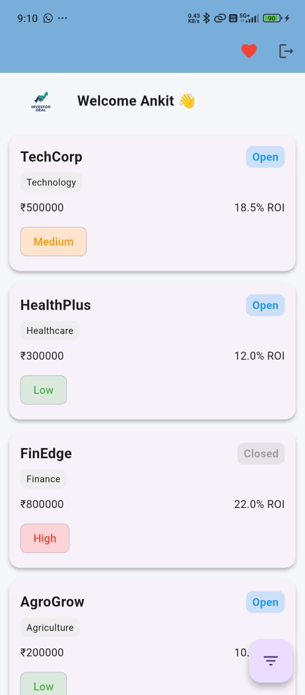

# 📊 Investor Deal App (Flutter)

A modern fintech-style Flutter application where corporates post investment opportunities and investors can explore, filter, and express interest.

---

## 🚀 Features

🔐 Mock Authentication (Email & Password)  
💾 Session Persistence using SharedPreferences  
📊 Deal Listing with clean UI  
🔍 Search & Advanced Filters (Bottom Sheet UI)  
📈 ROI Chart Visualization (fl_chart)  
❤️ Save & Manage Interested Deals  
✨ Smooth Animations & Hero Transitions  

---

## 🧠 Architecture

- Clean Architecture (UI / BLoC / Data)
- BLoC for state management
- Repository pattern
- Local JSON as mock API

---

## 📱 Screens

| Login | Deal List | Filter | Detail | Interests |
|------|----------|--------|--------|-----------|
|  |  |  |  |  |

---

## ⚙️ Tech Stack

- Flutter
- Dart
- flutter_bloc
- SharedPreferences
- fl_chart

---

## ▶️ Run Project

```bash
flutter pub get
flutter run
