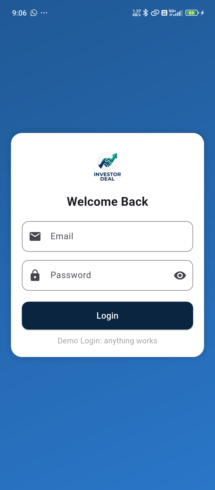
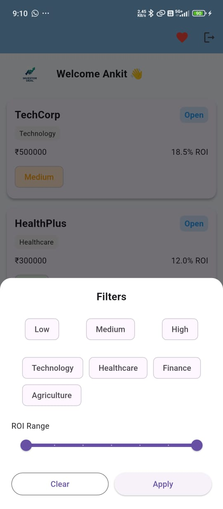
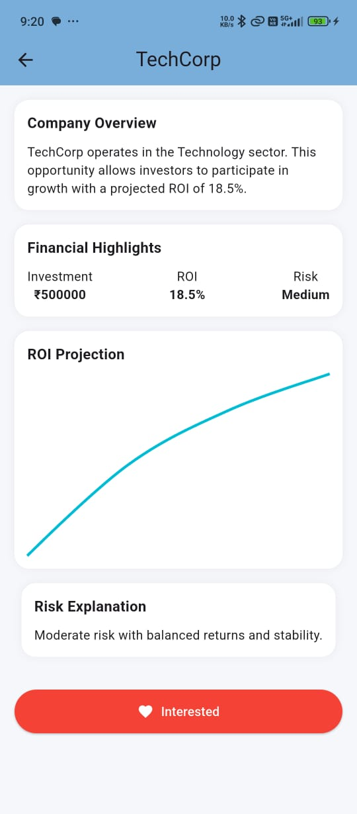
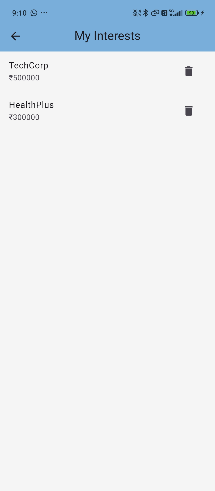

📊 Investor Deal App (Flutter)

A modern fintech-style Flutter application where corporates post investment opportunities and investors can browse, filter, and express interest.

---

🚀 Features

- 🔐 Mock Authentication (Email & Password)
- 💾 Session Persistence using SharedPreferences
- 📊 Deal Listing Screen (Clean UI)
- 🔍 Search & Advanced Filters (Risk, Industry, ROI)
- 📈 Deal Detail Screen with ROI Chart
- ❤️ Add / Remove Interest Feature
- 🎨 Smooth Animations & UI Polish
- 🦴 Skeleton Loading (Shimmer)

---

📁 Project Structure

lib/
│
├── core/
│   ├── constants/
│   │   └── app_colors.dart
│   ├── theme/
│   │   └── app_theme.dart
│
├── data/
│   ├── models/
│   │   └── deal_model.dart
│   ├── repositories/
│   │   └── deal_repository.dart
│   ├── data_sources/
│   │   └── deal_local_data_source.dart
│
├── business_logic/
│   └── blocs/
│       └── deal/
│           ├── deal_bloc.dart
│           ├── deal_event.dart
│           ├── deal_state.dart
│
├── presentation/
│   ├── screens/
│   │   ├── deal_detail_screen.dart
│   │   ├── deal_list_screen.dart
│   │   ├── login_screen.dart
│   │   ├── my_interest_screen.dart
│   │   └── splash_screen.dart
│   │
│   └── widgets/
│       ├── deal_card.dart
│       ├── deal_skeleton.dart
│       ├── filter_button_sheet.dart
│       └── search_bar.dart
│
└── main.dart

---

🧠 Architecture

This app follows Clean Architecture + BLoC pattern.

🔄 Data Flow

UI (Screens)

   ↓
   
BLoC (Business Logic)

   ↓
   
Repository

   ↓
   
Data Source (Local JSON)

   ↓
   
Response → Back to UI via State

---

⚙️ Tech Stack

- Flutter
- Dart
- flutter_bloc (State Management)
- SharedPreferences (Local Storage)
- fl_chart (Charts)
- shimmer (Skeleton Loading)

---

🧩 Architecture Decisions

1. Clean Architecture

Separated into:

- Presentation → UI
- Business Logic → BLoC
- Data Layer → Repository + Data Source

👉 Makes app scalable and maintainable

---

2. BLoC State Management

Used BLoC to:

- Handle business logic
- Manage UI state
- Enable testability

---

3. Local JSON Data Source

- Data loaded from "assets/deals.json"
- Simulates API behavior

---

4. SharedPreferences Usage

Used for:

- Login session persistence
- Saving user interests

---

5. Interest Feature Design

- Stores only deal IDs
- Maps IDs to full deal objects using BLoC

👉 Efficient and scalable approach

---

📱 Screens Overview

🔐 Login Screen

- Email & Password (Mock)
- Stores session locally

---

📊 Deal Listing Screen

Each card shows:

- Company Name
- Industry Tag
- Investment (INR)
- ROI (%)
- Risk Level
- Status (Open / Closed)

---

📈 Deal Detail Screen

- Company Overview
- Financial Highlights
- ROI Chart (fl_chart)
- Risk Explanation

---

❤️ My Interests Screen

- Displays saved deals
- Remove with confirmation dialog
- Opens detail screen on click

---

🚀 Splash Screen

- Logo with animation
- Session check → Redirect to login or home

---

🧪 Testing

✔ Widget Test

- UI rendering validation

✔ BLoC Test

- State transitions
- Filtering logic

Run tests:

flutter test

---

## 📱 Screens

| Login | List | Filter | Detail | Interest |
|------|----------|--------|--------|-----------|
|  |  |  |  |  |

---

⚡ Setup

flutter pub get
flutter run

---

📦 Build APK

flutter build apk

---

🎯 Future Improvements

- API integration
- Dark mode
- Notifications
- Real-time updates
- Pagination

---

👨‍💻 Author

- Ankit Kumar 
- Flutter Developer

---

⭐ Conclusion

This project demonstrates:

- Clean Architecture
- BLoC state management
- Scalable structure
- Production-level UI/UX

---

«🚀 Built as part of a Flutter assignment with focus on real-world design and performance.»
